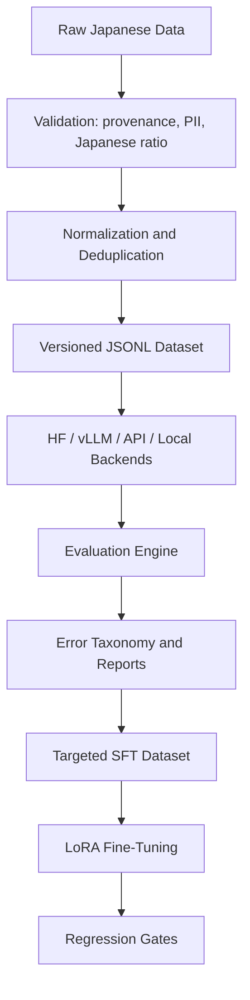

# JEvalOps

Japanese Enterprise LLM Evaluation & Adaptation.

JEvalOps is a reproducible framework for curating governed Japanese enterprise datasets, benchmarking LLMs across quality and efficiency dimensions, performing Japanese-specific error analysis, and preparing targeted LoRA fine-tuning data.

## Why This Exists

Japanese enterprise evaluation is hard because correct behavior depends on keigo, internal/external company perspective, omitted subjects, mixed scripts, date normalization, structured-output reliability, and grounded refusal behavior. A single aggregate score hides those failures, so JEvalOps reports task quality, latency, schema compliance, hallucination/failure-to-abstain behavior, and an explicit error taxonomy.

## Supported Tasks

- Business Japanese and keigo rewriting.
- Enterprise information extraction with JSON schema checks.
- Summarization with decisions and action items.
- Grounded question answering with abstention checks.
- Robustness for full-width/half-width text, Japanese eras, numerals, typos, and mixed terminology.

## Architecture



## Quickstart

```bash
python3 -m pip install -e ".[dev]"
make build-dataset
make baseline
make error-report
make report
```

The default backend is deterministic and local, so the full smoke path runs without downloading models. Use the Hugging Face or vLLM adapters once you select real model IDs and hardware.

## Repository Map

- `src/jevalops/data`: Pydantic schema, JSONL validation, PII checks, normalization, deduplication.
- `src/jevalops/generation`: controlled template generation and synthetic filters.
- `src/jevalops/inference`: shared backend contract plus local, Hugging Face, vLLM, and HTTP API adapters.
- `src/jevalops/evaluation`: exact metrics, JSON/schema checks, rubric scoring, efficiency metrics.
- `src/jevalops/analysis`: Japanese-specific error taxonomy and structured failure analysis.
- `src/jevalops/training`: SFT dataset export, LoRA entrypoint, model promotion gates.
- `scripts`: reproducible CLI stages.
- `demo`: Streamlit interface.

## Reproduction

```bash
PYTHONPATH=src python3 scripts/build_dataset.py --train-size 300 --validation-size 100 --test-size 250
PYTHONPATH=src python3 scripts/run_baseline.py --dataset data/test.jsonl --output reports/baseline_results.json
PYTHONPATH=src python3 scripts/run_error_analysis.py --evaluation reports/baseline_results.json --output reports/error_analysis.json
PYTHONPATH=src python3 scripts/generate_report.py --evaluation reports/baseline_results.json --errors reports/error_analysis.json --output reports/baseline_report.md
```

## API

```bash
python3 -m pip install -e ".[api]"
make api
curl -X POST http://localhost:8000/generate \
  -H "Content-Type: application/json" \
  -d '{"prompt":"指示:\n取引先への丁寧な依頼文に書き換えてください。\n\n入力:\n資料見たら返事ください\n\n回答:"}'
```

## Model Backends

The `ModelBackend` contract returns text, latency, approximate time-to-first-token, output tokens, throughput, memory, model name, and backend name. Real model adapters are available for Hugging Face Transformers and vLLM; the local backend exists for CI and sanity checks.

## Promotion Rule

A candidate model is promoted only when composite quality improves by at least 5%, no task drops by more than 2%, P95 latency remains within the configured limit, and schema compliance stays above 95%.

## Limitations

- The checked-in generator is a reproducible MVP, not a substitute for a frozen native-speaker benchmark.
- Synthetic data can reflect the generator or template author’s preferences.
- Japanese politeness often has multiple valid formulations.
- Automated scores do not fully capture naturalness or cultural appropriateness.
- Enterprise workflows require domain-expert review before deployment.
